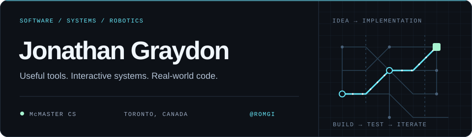
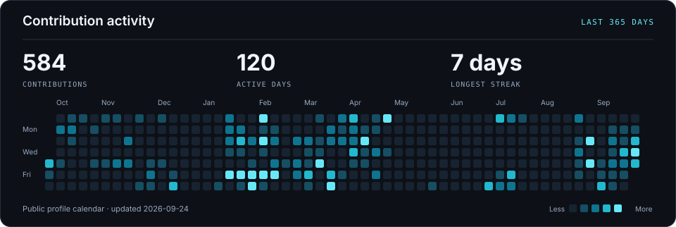
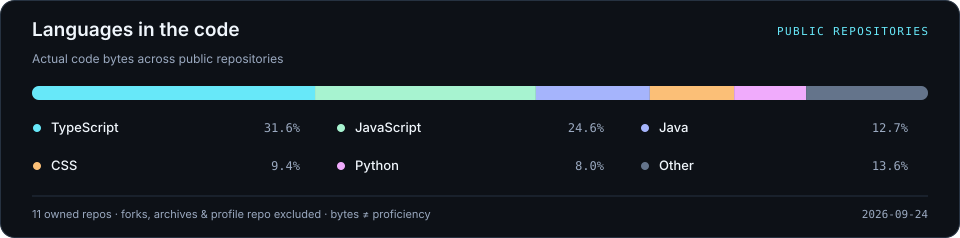

  

  <a href="https://www.jonathangraydon.com/"><strong>Portfolio ↗︎</strong></a>
  &nbsp; · &nbsp;
  <a href="#user-content-selected-work">Selected work</a>
  &nbsp; · &nbsp;
  <a href="#user-content-on-the-radar">GitHub activity</a>
  &nbsp; · &nbsp;
  <a href="https://romgi-productions.itch.io/">Games ↗︎</a>

I’m Jonathan, a **Computer Science student at McMaster University**. I build practical web apps, interactive tools, and software for FRC robotics. I like projects that connect what happens on screen to something useful in the real world.

- **Web & tools** — operations dashboards, algorithm visualizations, and computer vision.
- **Robotics** — swerve drive, autonomous path following, and FRC software.
- **Beyond the keyboard** — trumpet performance and game development.

## Selected work

<table>
<tr>
<td width="50%" valign="top">

### PC Turf
**Software for daily course operations**

A dashboard for Port Carling Golf and Country Club: employee assignments, course setup, live weather, and a TV presentation board.

TypeScript · Next.js · Prisma · PostgreSQL

[View source](https://github.com/Romgi/PCTurf) · [Live app ↗︎](https://pc-turf.vercel.app/) 
Live app requires sign-in.

</td>
<td width="50%" valign="top">

### RouteLab
**See how pathfinding actually works**

An interactive studio with seven algorithms, editable graphs, replayable execution traces, and synchronized comparisons.

TypeScript · React · Vite · Cloudflare Workers

[View source](https://github.com/Romgi/RouteLab) · [Try the demo ↗︎](https://routelab-algorithm-studio.jonathangraydon22.chatgpt.site/)

</td>
</tr>
<tr>
<td width="50%" valign="top">

### AprilTag Studio
**Computer vision you can inspect**

A Windows tool for live AprilTag detection, camera calibration, and interactive 3D pose visualization.

Python · PySide6 · OpenCV · NumPy

[View source](https://github.com/Romgi/apriltag-studio) · [Windows download ↗︎](https://github.com/Romgi/apriltag-studio/releases/latest)

</td>
<td width="50%" valign="top">

### Personal Portfolio
**Code, robots, and a little trumpet**

A home for my software projects, FRC robotics work, and trumpet experience, with responsive layouts and interactive motion.

Next.js · TypeScript · Tailwind CSS · GSAP

[View source](https://github.com/Romgi/Personal-Site) · [Visit the site ↗︎](https://www.jonathangraydon.com/)

</td>
</tr>
</table>

**More robotics:** [Swerve + PathPlanner](https://github.com/Romgi/SwerveWithPathPlanner) — Java experiments with WPILib, CTRE motor control, and autonomous path following.

## Toolkit

**Languages** &nbsp; TypeScript · JavaScript · Python · Java 
**Web** &nbsp; React · Next.js · Tailwind CSS · Prisma · PostgreSQL 
**Robotics & vision** &nbsp; WPILib · PathPlanner · OpenCV · AprilTag 
**Workflow** &nbsp; Git · GitHub · Vite

## On the radar

<a href="https://github.com/Romgi?tab=overview">
  <picture>
    <source media="(max-width: 600px)" srcset="./assets/activity-mobile.svg" />
    
  </picture>
</a>

<picture>
  <source media="(max-width: 600px)" srcset="./assets/languages-mobile.svg" />
  
</picture>

Generated from GitHub data and refreshed daily. Language share reflects repository code, not proficiency.

[View widget data as text](./assets/data.md)

---

  <strong>Explore the work behind the profile.</strong> 
  <a href="https://www.jonathangraydon.com/">jonathangraydon.com ↗︎</a>

